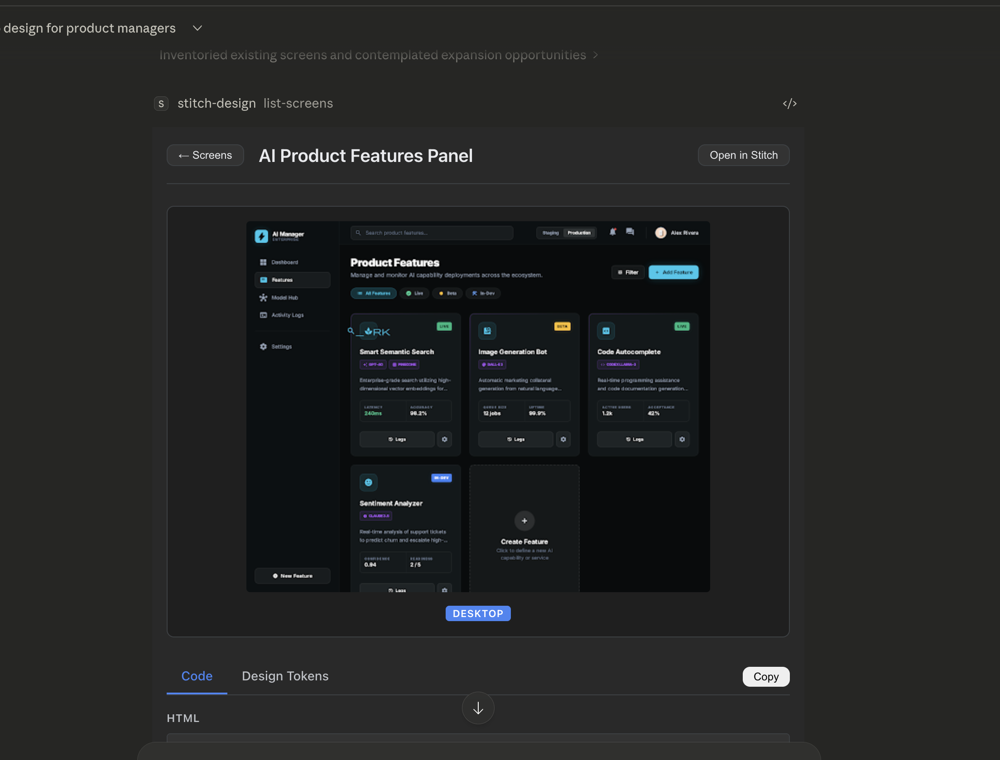
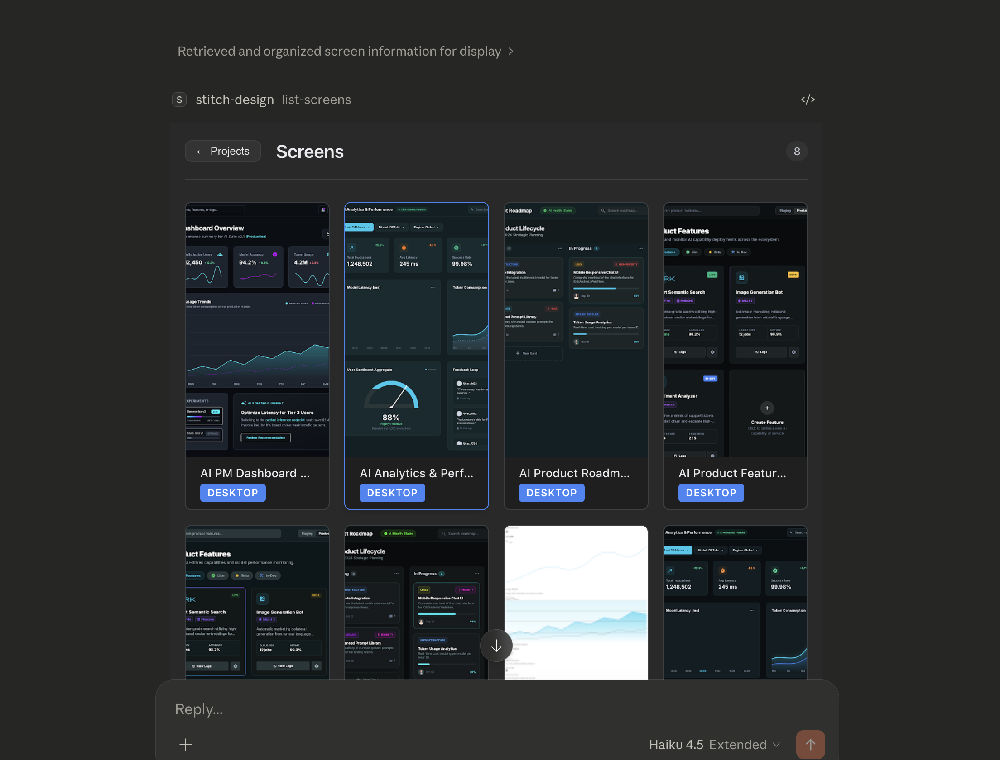
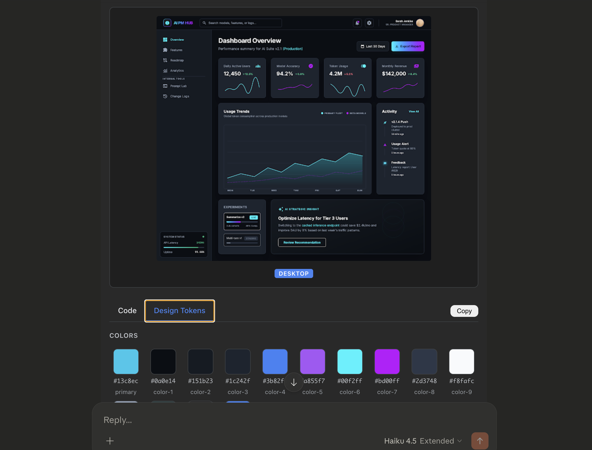

# Stitch Design Agent - MCP App

An interactive MCP App that brings [Google Stitch](https://stitch.google.com) design tools directly into AI assistants like Claude Code, Claude Desktop, and ChatGPT. Browse projects, view screen designs, extract design tokens, and generate new screens — all within your chat interface.

Built with the [MCP Apps (ext-apps)](https://modelcontextprotocol.io/docs/extensions/apps) extension, which renders interactive React UI inside MCP host sandboxed iframes.

## Screenshots

> Add screenshots of the app running inside Claude.ai or Claude Desktop to the `screenshots/` directory.



*Browse all your Stitch design projects with thumbnail previews*


*View all screens within a project with device type badges*


*Split panel view: screen preview with HTML/CSS code and design tokens*


## Features

| Tool | Description |
|------|-------------|
| `list-projects` | Browse all Stitch design projects with thumbnail previews, device types, and theme colors |
| `list-screens` | View all screens within a project as a thumbnail grid |
| `design-viewer` | Split panel showing screen preview alongside HTML/CSS code and extracted design tokens |
| `generate-design` | Generate new screen designs from text prompts using AI, with follow-up suggestions |
| `extract-design-context` | Extract design tokens (colors, fonts, spacing, layouts) for brand consistency |

## Installation

### Prerequisites

- Node.js >= 18
- A Google Cloud project with the [Stitch API](https://console.cloud.google.com/apis/library/stitch.googleapis.com) enabled
- [Application Default Credentials](https://cloud.google.com/docs/authentication/application-default-credentials) configured

```bash
# Authenticate with Google Cloud
gcloud auth application-default login
```

### Setup

```bash
# Clone the repo
git clone https://github.com/jayeshvpatil/stitch-mcp-app.git
cd stitch-mcp-app

# Install dependencies
npm install

# Build
npm run build
```

### Configure your MCP client

Add to your MCP client configuration (e.g. `~/.claude/mcp.json` for Claude Code):

```json
{
  "mcpServers": {
    "stitch-design": {
      "command": "node",
      "args": ["/path/to/stitch-mcp-app/dist/main.js"],
      "env": {
        "GOOGLE_CLOUD_PROJECT": "your-gcp-project-id"
      }
    }
  }
}
```

Replace `/path/to/stitch-mcp-app` with the actual path and `your-gcp-project-id` with your Google Cloud project ID.

## Usage

Once configured, you can interact with your Stitch designs through natural language:

```
"Show me my Stitch design projects"
"List screens in the Sentiment Dashboard project"
"View the Data Explorer screen design"
"Generate a mobile login screen with dark theme"
"Extract design tokens from this screen"
```

The app renders interactive UI cards directly in the chat — click project cards to drill into screens, click screens to view full designs with code.

## Architecture

```
stitch-mcp-app/
├── server.ts          # MCP server: 5 tools + 1 shared UI resource
├── main.ts            # stdio transport entry point
├── stitch-client.ts   # Stitch REST API client (google-auth-library)
├── mcp-app.html       # HTML entry for React UI
├── vite.config.ts     # Vite + vite-plugin-singlefile
└── src/
    ├── StitchApp.tsx   # Main component: useApp() hook + view routing
    ├── types.ts        # TypeScript interfaces matching Stitch API
    ├── global.css      # Dark mode responsive styles
    └── components/
        ├── ProjectList.tsx    # Project card grid
        ├── ScreenList.tsx     # Screen thumbnail grid
        ├── DesignViewer.tsx   # Split panel (image + code/tokens)
        ├── GenerateDesign.tsx # AI generation + suggestions
        └── DesignContext.tsx  # Design token display
```

**Key patterns:**
- Single shared UI resource (`ui://stitch-design/app.html`) across all 5 tools
- React UI bundled into a single HTML file via Vite + `vite-plugin-singlefile`
- Tools return `{ type, data }` JSON — React app routes views via `ontoolresult`
- Direct Stitch API calls using `google-auth-library` (not proxied)

## Development

```bash
# Watch mode (rebuilds on changes)
npm run dev

# Build UI only
npm run build:ui

# Build server only
npm run build:server

# Full build
npm run build
```

## License

MIT
